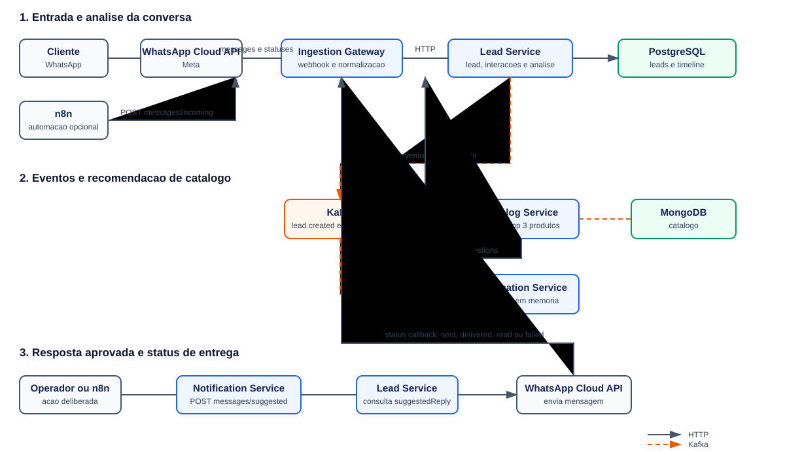
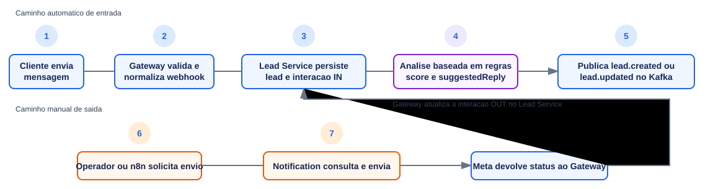
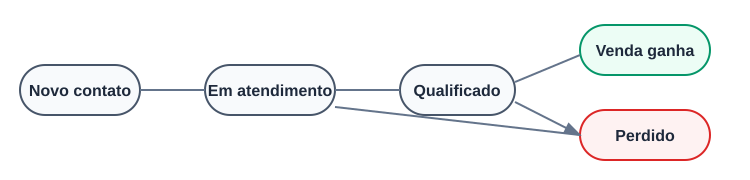
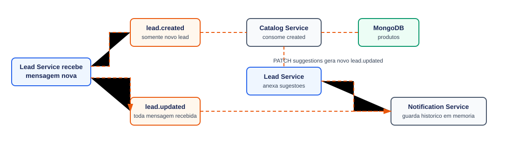

# AnySale

Plataforma de atendimento e gestão de leads para transformar mensagens de clientes em oportunidades organizadas, priorizadas e prontas para conversão.

O MVP atual recebe conversas do WhatsApp, consolida o histórico de cada contato, gera uma leitura comercial da conversa e sugere a próxima resposta. O time mantém a decisão final: a sugestão pode ser revisada e enviada manualmente pelo WhatsApp.

> Arquitetura hexagonal · Java 17 · Spring Boot · Kafka · PostgreSQL · MongoDB · n8n · WhatsApp Cloud API

## Objetivo do produto

Reduzir o tempo entre uma mensagem de interesse e uma resposta comercial relevante. Em vez de tratar cada conversa isoladamente, o AnySale mantém um lead com contexto, intenção, pontuação, histórico e recomendações de produto.

O fluxo prioriza três resultados:

- **Atendimento rápido:** uma mensagem recebida cria ou atualiza o lead automaticamente.
- **Contexto comercial:** a conversa vira resumo, intenção, score, próxima ação e resposta sugerida.
- **Ação rastreável:** mensagens enviadas e os status `sent`, `delivered`, `read` e `failed` ficam associados ao histórico do lead.

## O que já está pronto

| Capacidade | Situação atual |
| --- | --- |
| Entrada de mensagens | Webhook direto da WhatsApp Cloud API e endpoint normalizado para n8n/integradores. |
| Identificação do lead | Criação ou atualização por telefone normalizado, com deduplicação por `externalMessageId`. |
| Histórico da conversa | Interações de entrada e saída persistidas no PostgreSQL. |
| Leitura comercial | Assistente baseado em regras gera resumo, intenção, categoria/tags, score, próxima ação e resposta sugerida. |
| Resposta WhatsApp | Envio manual de texto ou da resposta sugerida, via WhatsApp Cloud API. |
| Acompanhamento de envio | Atualizações de status da Meta persistidas na interação correspondente. |
| Catálogo e recomendações | Catálogo no MongoDB e sugestões de produtos assíncronas por Kafka. |
| Segurança interna | Endpoints de automação aceitam `X-Internal-Token` quando `ANYSALE_INTERNAL_TOKEN` está configurado. |
| Operação local | Docker Compose com PostgreSQL, MongoDB, Kafka e painel do n8n. |

## Visão da arquitetura



Cada serviço segue o padrão hexagonal: regras de negócio ficam no domínio/aplicação; REST, Kafka, banco de dados e integrações externas ficam nos adaptadores.

## Jornada de uma conversa



## Estados do lead



## Serviços e responsabilidades

| Serviço | Porta | Responsabilidade |
| --- | ---: | --- |
| `anysale-ingestion-gateway` | 8083 | Recebe webhooks da Meta e mensagens normalizadas; valida assinatura, normaliza dados e encaminha ao core. |
| `anysale-lead-service` | 8080 | Fonte de verdade dos leads, interações, funil, análise comercial e resposta sugerida. |
| `anysale-catalog-service` | 8082 | Mantém o catálogo e calcula recomendações de produto. |
| `anysale-notification-service` | 8081 | Envia mensagens WhatsApp e registra o histórico de notificações. |
| `anysale-contracts` | — | Contratos de eventos Kafka compartilhados. |
| `anysale-shared-kernel` | — | Value objects e utilitários Java sem dependência de Spring. |

## Fluxo de eventos



- `lead.created`: produzido pelo Lead Service e consumido pelo Catalog Service.
- `lead.updated`: produzido pelo Lead Service e consumido pelo Notification Service.

## Infraestrutura local

O Docker Compose sobe apenas a infraestrutura compartilhada:

```bash
docker compose -f infra/docker-compose.yml up -d
```

| Componente | Endereço local |
| --- | --- |
| PostgreSQL 16 | `localhost:5435` — banco/usuário `anysale`, senha `secret` |
| MongoDB 6 | `localhost:27017` |
| Kafka | `localhost:9092` |
| n8n | [http://localhost:5678](http://localhost:5678) |

## Executar o projeto

Pré-requisitos: Java 17, Maven 3.9+, Docker e Docker Compose. Para desenvolvimento pela IDE, habilite o Lombok.

```bash
# 1. Subir infraestrutura
docker compose -f infra/docker-compose.yml up -d

# 2. Compilar e testar todos os módulos
mvn clean package

# 3. Subir os serviços (um terminal por comando)
mvn -f anysale-lead-service spring-boot:run
mvn -f anysale-catalog-service spring-boot:run
mvn -f anysale-notification-service spring-boot:run
mvn -f anysale-ingestion-gateway spring-boot:run
```

Health checks:

```bash
curl http://localhost:8080/actuator/health
curl http://localhost:8081/actuator/health
curl http://localhost:8082/actuator/health
curl http://localhost:8083/actuator/health
```

## Integração WhatsApp e n8n

### WhatsApp Cloud API

Configure a Meta para chamar o Gateway:

```text
GET/POST /v1/whatsapp/webhook
```

Variáveis necessárias para a integração real:

- `WHATSAPP_WEBHOOK_VERIFY_TOKEN`
- `WHATSAPP_APP_SECRET`
- `WHATSAPP_ACCESS_TOKEN`
- `WHATSAPP_PHONE_NUMBER_ID`

Em produção, o webhook deve estar publicamente acessível em HTTPS e a assinatura `X-Hub-Signature-256` deve ser validada. Os campos `messages` e `statuses` precisam estar assinados na Meta.

### n8n

O n8n pode testar ou ampliar automações usando o endpoint normalizado:

```text
POST http://localhost:8083/v1/messages/incoming
```

Quando a variável `ANYSALE_INTERNAL_TOKEN` estiver configurada, envie também:

```http
X-Internal-Token: <token-compartilhado>
```

O mesmo token deve ser usado no Gateway, Lead Service, Notification Service e n8n. Em ambiente local, sem a variável, a proteção fica desabilitada.

O contrato completo, exemplos de payload e endpoints estão em [docs/n8n-contract.md](docs/n8n-contract.md).

## Endpoints principais

| Serviço | Endpoint | Finalidade |
| --- | --- | --- |
| Gateway | `POST /v1/whatsapp/webhook` | Recebe eventos da Meta. |
| Gateway | `POST /v1/messages/incoming` | Recebe mensagem normalizada de n8n/integradores. |
| Lead | `GET /v1/leads/{leadId}` | Consulta o lead, incluindo análise e `suggestedReply`. |
| Lead | `GET /v1/leads/{leadId}/interactions` | Consulta a linha do tempo da conversa. |
| Lead | `PATCH /v1/leads/{leadId}/enrichment` | Atualiza análise comercial externa, se necessária. |
| Notification | `POST /v1/notifications/whatsapp/messages` | Envia texto WhatsApp informado pelo operador. |
| Notification | `POST /v1/notifications/whatsapp/messages/suggested` | Envia a última resposta sugerida para o lead. |
| Catalog | `POST /v1/products` | Inclui produtos no catálogo. |
| Catalog | `GET /v1/products` | Lista produtos. |

A coleção de testes locais está em [postman/collections/AnySale (Local).postman_collection.json](<postman/collections/AnySale (Local).postman_collection.json>).

## Dados persistidos

No PostgreSQL, o Lead Service mantém:

- dados de identificação e estágio do lead;
- resumo, intenção, score, próxima ação, categoria e tags de interesse;
- resposta sugerida e momento de geração;
- interações de entrada e saída, inclusive identificador externo e status de entrega;
- sugestões de produto.

As migrations Flyway ficam em `anysale-lead-service/src/main/resources/db/migration`.

## Próximas evoluções

1. Implementar **outbox** para publicação idempotente dos eventos Kafka.
2. Persistir o histórico de notificações em PostgreSQL.
3. Substituir/expandir o assistente baseado em regras por um provedor de IA configurável.
4. Adicionar autenticação de usuários, RBAC e multi-tenancy.
5. Incluir observabilidade com Prometheus, Grafana e OpenTelemetry.
6. Criar conectores para Facebook Lead Ads, Shopify, WooCommerce e outros canais.

## Troubleshooting

**Kafka falha ao desserializar eventos**

Garanta `spring.kafka.*.trusted.packages=com.anysale.contracts.events` nos consumidores e use os DTOs de `anysale-contracts`. Para mensagens antigas incompatíveis, use outro `group-id` ou limpe o tópico de desenvolvimento.

**Falha de conexão com banco em containers**

Dentro de containers, use `pg-anysale` e `mongo-anysale`, não `localhost`.

**Flyway checksum mismatch**

Não altere migrations já aplicadas. Crie uma nova migration; em ambiente local, `flyway repair` pode ser usado conscientemente.
